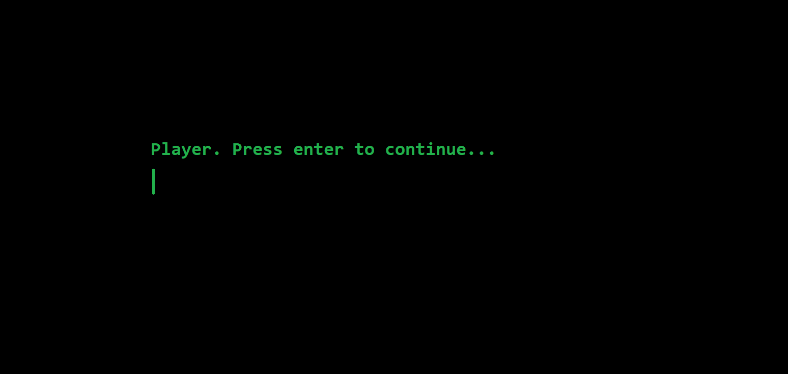

# SpaceInvaders

## Classes
1. Game (Engine). Contains all the game logic: render, display, update etc.
2. Window. Draws and shows the text and buttons on the screen.
3. IntroWindow. Inherits Window.
4. GameWindow. Inherits Window.
5. ScoreboardWindow. Inherits Window.
6. Entity. Movement, positioning and other things.
7. Spaceship. Inherits Entity.
8. EnemySpaceship. Inherits Spaceship.
9. AllySpaceship. Inherits Spaceship.
10. SpaceshipBullet. Inherits Entity.
11. Score. Get the record, track the record.
12. FileStream.
13. ScoreFileStream. Inherits FileStream.
14. Player. Accepts AllySpaceship and Score.
15. Level. 5 levels.

## Player experience

### Before the "play"
1. IntroWindow. When text is entered, blinking cursor disappears, and the text is shown. 
   If the text is not valid, play "beep" sound and make it only for 10 chars long.
   

### The "play"
1. GameWindow
   

### After the "play"
1. ScoreboardWindow.
   
2. "See you space cowboy..." text pop-ups and the game closes.
   
